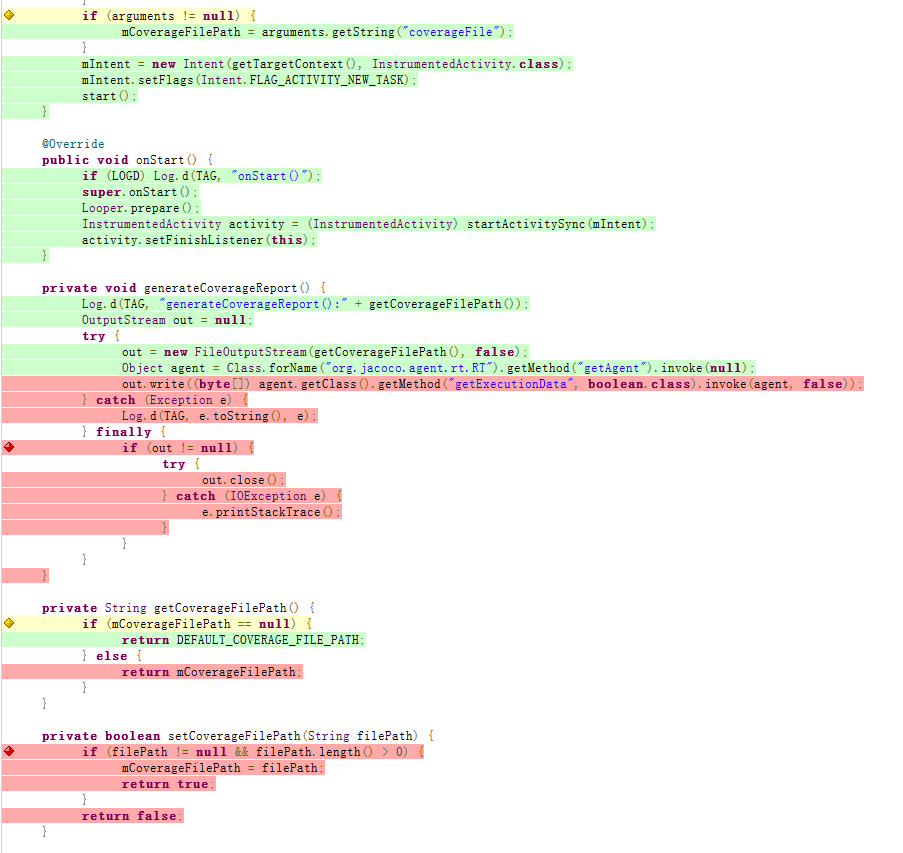

Jacoco代码覆盖率Demo

### 生成的代码覆盖率结果

总结分析

分析每一行代码

基本过程：

1.在真机或者模拟器上运行一下app，并点击返回退出。

2.在命令行下通过adb shell am instrument命令调起app，具体命令是：
adb shell am instrument r.com.jacocodemo/r.com.jacocodemo.test.JacocoInstrumentation

3.进行app手工测试，测试完成后退出App，覆盖率文件会保存在手机/data/data/r.com.jacocodemo/files/coverage.ec目录

4.导出coverage.ec使用gradle jacocoTestReport分析覆盖率文件并生成html报告

5.查看覆盖率html报告(...\JacocoDemo\app\build\reports\jacoco\jacocoTestReport\html)

